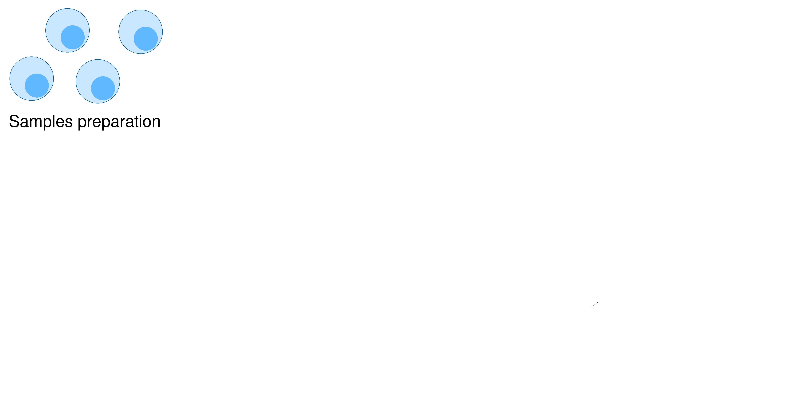
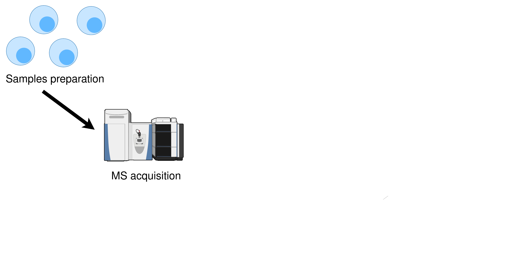
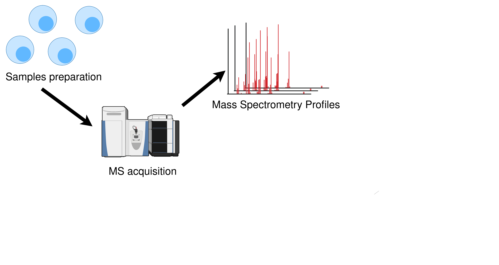
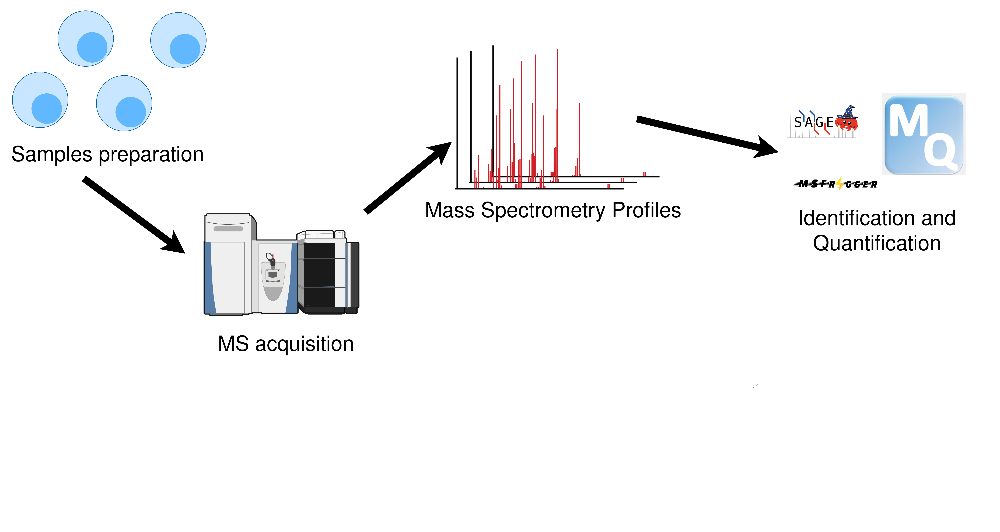
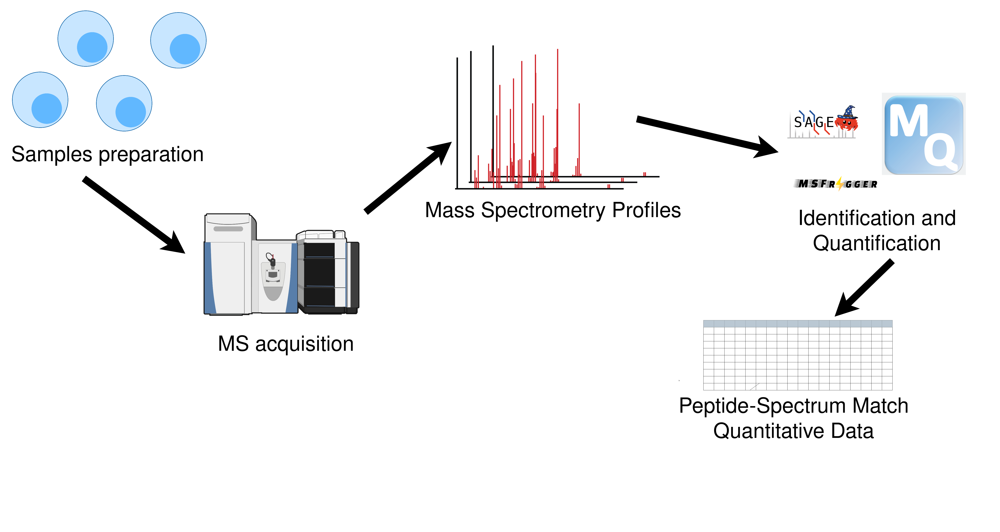
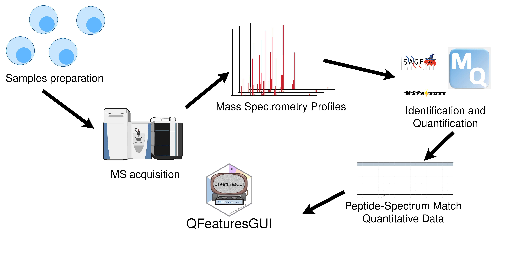
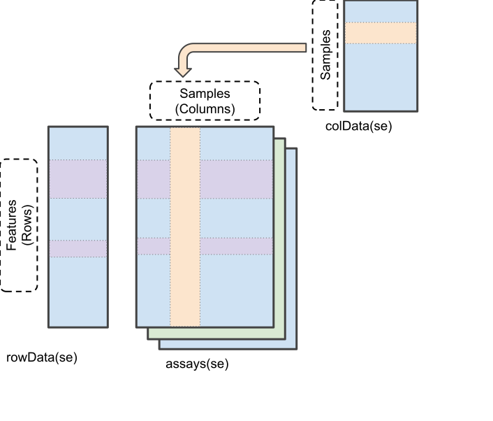
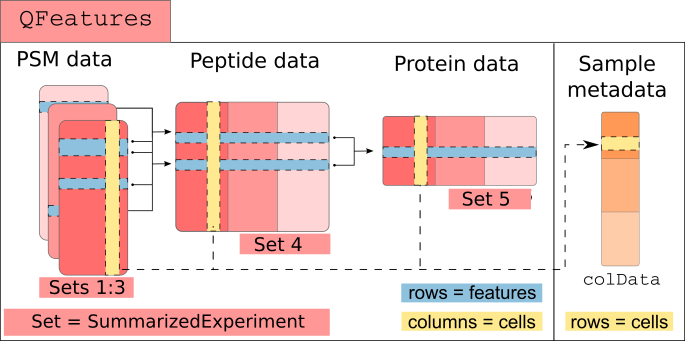
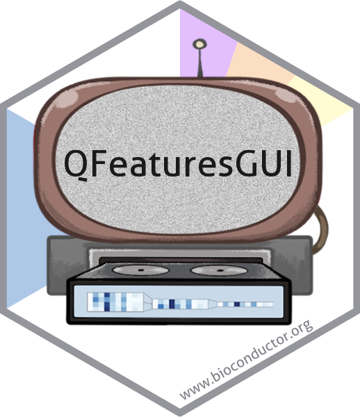

## Pourquoi étudier la single-cell proteomics ?

::: {.single-cell-proteome-main}

- Protéines = activité cellulaire

- La corrélation ARNm/protéines n'est pas parfaite [Budnik et al., 2018]

- Causes:
  - Régulation traductionnelle
  - Dégradation
  - Modifications post-traductionnelles

:::

::: {.single-cell-proteome-reference}
Budnik B, Levy E, Harmange G, Slavov N. SCoPE-MS: mass spectrometry of single mammalian cells quantifies proteome heterogeneity during cell differentiation. *Genome Biology*, 19(1):161, October 2018.
:::


## Contexte

::: {.context-steps}

{.fragment}
{.fragment}
{.fragment}
{.fragment}
{.fragment}
:::


## Structure de données 


### SummarizedExperiment

::::: columns
::: {.column width="40%" style="font-size: 40%;"}

*Figure modifiée depuis la vignette SummarizedExperiment*
:::
::: {.column width="60%" style="font-size: 70%;"}

Classe `SummarizedExperiment`:

assay = données quantitatives.

rowData = Annotations des variables d'intérêt (gènes, transcripts, protéines, ...).

colData =  Annotation des échantillons.

:::
:::::


## QFeatures

L'infrastructure QFeatures permet la gestion et le traitement de données quantitatives de spectrométrie.

Ce qu'il faut savoir :

::::: columns
::: {.column width="40%" style="font-size: 60%;"}
\- Un objet QFeatures est composé de plusieurs sets

\- Chaque set est un `SummarizedExperiment`

\- Modifier les données entraine la création de nouveaux sets.

\- Existence de lien entre les sets. 

\- L'objet final contient chaque version des données. 
:::

::: {.column width="60%" style="font-size: 70%;"}

:::
:::::

## Pourquoi utiliser QFeaturesGUI ?

\- Application en single-cell et bulk protéomique.

\- Permet à des non experts d'utiliser l'écosystème BioConductor.

\- Interactivité et visualisation.

{fig-align="center"}

## QFeaturesGUI
::: {style="font-size:80%"}

- Installation du package:
:::
```{r, eval=FALSE, echo=TRUE}
# install.packages("BiocManager")

BiocManager::install("UCLouvain-CBIO/QFeaturesGUI")
```

::: {style="font-size:70%"}
`QFeaturesGUI` contient 2 applications shiny 

- `importQFeatures`

- `processQFeatures`

:::

## importQFeatures

### Données d'entrée
::: {style="font-size:80%"}

`assayData`: table générée après l'identification et la quantification des spectres de MS.

  - Colonnes quantitatives

  - Annotations des variables d'intérêt (séquence peptidique, charge des ions, ...)
  
  - (Colonne d'identifiant d'acquisition)
:::

## importQFeatures

### Données d'entrée

::: {style="font-size:90%"}

`colData`:  table contenant le design expérimental (optionnel). 

  - Une colonne `quantCols` identifiant la colonne quantitative dans l'`assayData` associé à chaque échantillon.
      
  - (Une colonne `runCol` identifiant l'acquisition associé à chaque échantillon.)

:::

## importQFeatures

### En pratique


```{r, echo=TRUE, eval=FALSE}
library(QFeaturesGUI)

importQFeatures()
```


## processQFeatures

### But de l'application

:::{style="font-size:80%"}

`processQFeatures` est une application permettant l'analyse des objets QFeatures.

:::

### Données d'entrée

:::{style="font-size:80%"}

Il existe plusieurs choix afin de passer un objet QFeatures.


```{r, eval=FALSE, echo=TRUE}
# qf_objet est un objet QFeatures dans l'environnement
processQFeatures(qf = qf_objet)

# ou
# pathToRDS est un fichier rds contenant un objet QFeatures
processQFeatures(qf = "pathToRDS")
```

:::

## Conclusions

### Disponibilité du package

:::{style="font-size:70%"}

[Disponibilité sur github]{style="text-decoration: underline;"}:

\- github.com/UCLouvain-CBIO/QFeaturesGUI 

[Disponibilité via Docker]{style="text-decoration: underline"}:

\- Une image pour chaque application sera disponible via Dockerhub

Disponibilité via Bioconductor sur la release 3.25

:::

### Développements futurs

:::{style="font-size:70%"}

\- Optimisation du package

\- Une application de visualisation (iSEEQFeatures)

\- Une application d'exploration de résultats d'abondance différentielle (iSEEda)

:::
